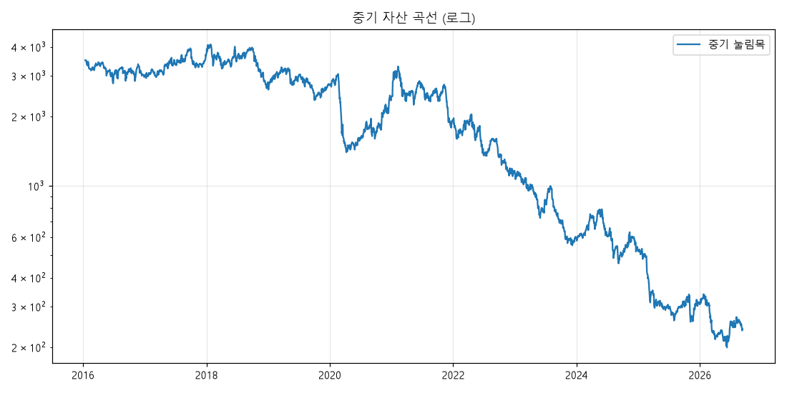

# 미국 중기 (추세 눌림목) 백테스트 리포트
기간 2016-01-01 ~ 2026-09-10, 초기 자산 $3,500, 리스크 2%/회, 동시 최대 5종목, 한 종목 최대 30%
## 요약
| 항목 | 인샘플 2016~2020 | 아웃오브샘플 2021~ | 전체 |
|---|---|---|---|
| 총수익률 | -30.7% | -90.1% | -93.1% |
| CAGR | -7.1% | -33.5% | -22.2% |
| MDD | -65.9% | -93.9% | -95.1% |
| 거래 수 | 391 | 532 | 923 |
| 승률 | 28.9% | 23.5% | 25.8% |
| 손익비 | 1.96 | 2.64 | 2.31 |
| 프로핏팩터 | 0.80 | 0.81 | 0.80 |
| 기대값(R) | -0.06 | -0.21 | -0.15 |
| 평균 보유일 | 14.7 | 13.5 | 14.0 |
| 상위10 거래 이익 비중 | 31.3% | 46.6% | 25.8% |
| 최종 자산 | 2,424 | 240 | 240 |

## 셋업별
| 항목 | pullback |
|---|---|
| 총수익률 | -93.1% |
| CAGR | -22.2% |
| MDD | -95.1% |
| 거래 수 | 923 |
| 승률 | 25.8% |
| 손익비 | 2.31 |
| 프로핏팩터 | 0.80 |
| 기대값(R) | -0.15 |
| 평균 보유일 | 14.0 |
| 상위10 거래 이익 비중 | 25.8% |
| 최종 자산 | 240 |

## 연도별
| 연도 | 거래 수 | 승률 | 합계 손익($) | 평균 R |
|---|---|---|---|---|
| 2016 | 67 | 26.9% | -613 | -0.16 |
| 2017 | 63 | 34.9% | 330 | 0.34 |
| 2018 | 90 | 26.7% | -527 | -0.06 |
| 2019 | 74 | 31.1% | -466 | -0.16 |
| 2020 | 97 | 26.8% | -838 | -0.19 |
| 2021 | 87 | 29.9% | 436 | 0.15 |
| 2022 | 101 | 21.8% | -762 | -0.33 |
| 2023 | 108 | 17.6% | -586 | -0.46 |
| 2024 | 75 | 28.0% | -86 | -0.03 |
| 2025 | 91 | 24.2% | -168 | -0.50 |
| 2026 | 70 | 21.4% | 19 | 0.07 |

## 청산 사유별
| 사유 | 거래 수 | 평균 손익% |
|---|---|---|
| 120일 만료 | 4 | 74.67% |
| SMA50 이탈 | 519 | 3.34% |
| 갭하락 손절 | 87 | -10.51% |
| 백테스트 종료 | 5 | 15.12% |
| 손절 | 308 | -7.10% |

## 리스크 비율 비교
| 항목 | 리스크 1% | 리스크 2% | 리스크 4% |
|---|---|---|---|
| 총수익률 | -76.1% | -93.1% | -93.6% |
| CAGR | -12.6% | -22.2% | -22.7% |
| MDD | -79.2% | -95.1% | -95.5% |
| 거래 수 | 926 | 923 | 908 |
| 승률 | 26.0% | 25.8% | 25.9% |
| 손익비 | 2.25 | 2.31 | 2.21 |
| 프로핏팩터 | 0.79 | 0.80 | 0.77 |
| 기대값(R) | -0.13 | -0.15 | -0.08 |
| 평균 보유일 | 14.0 | 14.0 | 14.2 |
| 상위10 거래 이익 비중 | 23.7% | 25.8% | 27.7% |
| 최종 자산 | 836 | 240 | 225 |

## 몬테카를로 1000회 (거래 R 을 복원 추출)
| 수익률 5% | 수익률 50% | 수익률 95% | MDD 5%(최악) | MDD 50% | 손실 확률 |
|---|---|---|---|---|---|
| -99.4% | -96.7% | -76.3% | -99.6% | -97.6% | 99.4% |

## 주의
- **생존 편향**: yfinance 에는 상장폐지 종목이 없어 실제보다 결과가 좋게 나옵니다.
- **EP 거래량**: 백테스트는 당일 전체 거래량을 써서(장중에는 알 수 없는 값) 미래 정보가 약간 섞입니다.
- **수수료·슬리피지**: 편도 0.25% + 0.2% 를 진입·청산 모두에 적용했습니다.
- 과거 성과는 미래 수익을 보장하지 않습니다.

