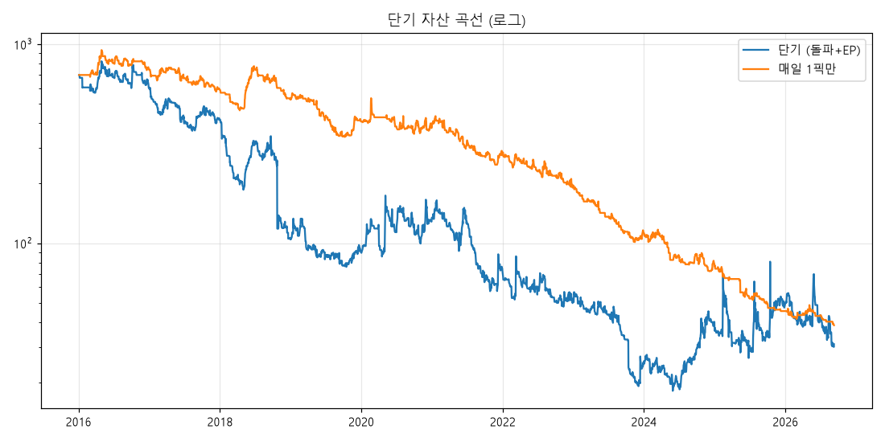

# 미국 단기 (돌파 + EP) 백테스트 리포트
기간 2016-01-01 ~ 2026-09-10, 초기 자산 $700, 리스크 5%/회, 동시 최대 3종목, 한 종목 최대 50%
## 요약
| 항목 | 인샘플 2016~2020 | 아웃오브샘플 2021~ | 전체 |
|---|---|---|---|
| 총수익률 | -80.8% | -76.9% | -95.6% |
| CAGR | -28.2% | -22.7% | -25.3% |
| MDD | -90.7% | -89.0% | -97.8% |
| 거래 수 | 386 | 486 | 872 |
| 승률 | 36.0% | 29.8% | 32.6% |
| 손익비 | 1.32 | 1.89 | 1.57 |
| 프로핏팩터 | 0.74 | 0.80 | 0.76 |
| 기대값(R) | -0.05 | -0.08 | -0.07 |
| 평균 보유일 | 5.2 | 4.6 | 4.9 |
| 상위10 거래 이익 비중 | 39.5% | 44.4% | 31.7% |
| 최종 자산 | 134 | 31 | 31 |

## 셋업별
| 항목 | breakout | ep |
|---|---|---|
| 총수익률 | -95.6% | -95.6% |
| CAGR | -25.3% | -25.3% |
| MDD | -97.8% | -97.8% |
| 거래 수 | 707 | 165 |
| 승률 | 33.0% | 30.9% |
| 손익비 | 1.66 | 1.43 |
| 프로핏팩터 | 0.81 | 0.64 |
| 기대값(R) | -0.12 | 0.15 |
| 평균 보유일 | 5.1 | 4.1 |
| 상위10 거래 이익 비중 | 34.2% | 65.5% |
| 최종 자산 | 31 | 31 |

## 연도별
| 연도 | 거래 수 | 승률 | 합계 손익($) | 평균 R |
|---|---|---|---|---|
| 2016 | 61 | 36.1% | -102 | 0.03 |
| 2017 | 80 | 38.8% | -189 | -0.11 |
| 2018 | 80 | 31.2% | -196 | -0.13 |
| 2019 | 88 | 40.9% | -15 | -0.04 |
| 2020 | 77 | 32.5% | 34 | 0.01 |
| 2021 | 81 | 27.2% | -53 | -0.23 |
| 2022 | 90 | 30.0% | -21 | -0.14 |
| 2023 | 85 | 28.2% | -31 | -0.41 |
| 2024 | 64 | 34.4% | 17 | 0.49 |
| 2025 | 83 | 31.3% | 11 | 0.13 |
| 2026 | 83 | 28.9% | -20 | -0.17 |

## 청산 사유별
| 사유 | 거래 수 | 평균 손익% |
|---|---|---|
| SMA10 이탈 | 231 | 13.64% |
| 갭하락 손절 | 214 | -8.51% |
| 백테스트 종료 | 3 | -1.99% |
| 손절 | 424 | -4.10% |

## 리스크 비율 비교
| 항목 | 리스크 2% | 리스크 5% | 리스크 10% |
|---|---|---|---|
| 총수익률 | -87.8% | -95.6% | -95.6% |
| CAGR | -17.9% | -25.3% | -25.3% |
| MDD | -93.9% | -97.8% | -97.8% |
| 거래 수 | 975 | 872 | 872 |
| 승률 | 32.5% | 32.6% | 32.6% |
| 손익비 | 1.74 | 1.57 | 1.57 |
| 프로핏팩터 | 0.84 | 0.76 | 0.76 |
| 기대값(R) | -0.10 | -0.07 | -0.07 |
| 평균 보유일 | 4.9 | 4.9 | 4.9 |
| 상위10 거래 이익 비중 | 23.2% | 31.7% | 31.7% |
| 최종 자산 | 85 | 31 | 31 |

## 몬테카를로 1000회 (거래 R 을 복원 추출)
| 수익률 5% | 수익률 50% | 수익률 95% | MDD 5%(최악) | MDD 50% | 손실 확률 |
|---|---|---|---|---|---|
| -100.0% | -99.8% | -83.0% | -100.0% | -99.9% | 99.1% |

## 변형: 매일 1픽만 매매 (후보 중 점수 1위 돌파만 진입)
| 항목 | 전체 후보 | 1픽만 |
|---|---|---|
| 총수익률 | -95.6% | -94.5% |
| CAGR | -25.3% | -23.7% |
| MDD | -97.8% | -95.9% |
| 거래 수 | 872 | 472 |
| 승률 | 32.6% | 33.7% |
| 손익비 | 1.57 | 1.43 |
| 프로핏팩터 | 0.76 | 0.72 |
| 기대값(R) | -0.07 | -0.20 |
| 평균 보유일 | 4.9 | 4.9 |
| 상위10 거래 이익 비중 | 31.7% | 43.0% |
| 최종 자산 | 31 | 39 |

1픽 규칙: 3개월 수익률 순위 + 횡보 폭(좁을수록) + 거래량 감소율 + 종가의 트리거가 근접도 평균 순위 1위.

## 주의
- **생존 편향**: yfinance 에는 상장폐지 종목이 없어 실제보다 결과가 좋게 나옵니다.
- **EP 거래량**: 백테스트는 당일 전체 거래량을 써서(장중에는 알 수 없는 값) 미래 정보가 약간 섞입니다.
- **수수료·슬리피지**: 편도 0.25% + 0.2% 를 진입·청산 모두에 적용했습니다.
- 과거 성과는 미래 수익을 보장하지 않습니다.

